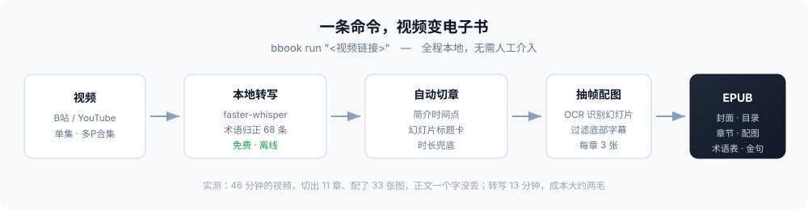

<div align="center">

# bbook

B站和 YouTube 上的长视频，早就成了最重要的学习渠道。<br>
可看完再自己动手记笔记，实在太费时间了。

**bbook 帮你省掉这一步：一条命令，把长视频变成一本能读的 EPUB。**<br>
有封面、有目录、有章节、有配图，还有术语表。

60 分钟的视频，模型成本两毛钱左右。


[三分钟上手](#三分钟上手) · [先看成品](#先看成品) · [它和总结工具不是一路的](#它和总结工具不是一路的) · [English](#english)

</div>



## 具体省在哪儿

比如你在 B 站刷到一门 46 分钟的技术课，讲到第三代 Agent 的 MCP 协议，想回头看那一段。

- **拖进度条**：来回找五分钟，还不一定找得准。
- **丢给 AI 总结**：它给你 500 字摘要。可你要的是那 8 分钟里的每一个细节。
- **自己动手**：转文字、分段、切章、截图配图，一个下午没了。

bbook 把这一下午，压成一条命令：

```bash
bbook run "https://www.bilibili.com/video/BVxxxxxxxxxx/"
```

跑完打开 `work/<视频ID>/book.epub`——**一个字没删**，但已经分好段、切好章、
配好幻灯片截图，还带着术语表和目录。

## 先看成品

`examples/` 里放着一本真的，1.7 MB，下载就能看：

**[AI Agent 编年史（2022—2026 五代演进）· 配图版](examples/AI-Agent编年史-配图版.epub)**

拿它当验收标准：

| 喂进去 | 吐出来 |
|---|---|
| B站 46 分钟技术视频（全程 PPT 口播） | 11 章 EPUB，1.78 MB |
| 2750 秒音频 | 878 段转写 → 100 个自然段，16,715 字 |
| | 33 张自动挑出来的幻灯片配图，每章 3 张，图注都标着视频时间点 |
| | 19 条术语、10 句金句、11 章时间轴 |
| | 正文一个字没丢 |

> 那条视频的原作者声明了 CC BY-SA 4.0，所以这本示例也按同样的协议放出来（署名要求见 `examples/README.md`）。
> 代码是 MIT，示例内容是 CC BY-SA 4.0，两码事。

## 图和话，是扣在一起的

多数工具的“配图”是装饰：随便挑几张截图塞进去，图和文没关系。

bbook 做的是把**他当时讲的话，和当时屏幕上那张图**扣到一起。

原理不复杂：一张 PPT 在屏幕上停 30 秒，这 30 秒里他讲的话，就是这张图的讲解词。
两边都带时间戳，所以配对是**时间区间问题**，不需要什么“理解”。

实测（46 分钟视频、70 张幻灯片）：

| 拿什么跟这张图比 | 文字重合率 |
|---|---|
| **他讲这张图那段时间说的话** | **45.4%** |
| 随便挑一段时间说的话 | 8.3% |

→ **提升 5.5 倍，70 张全部命中。**

所以书里每一页读起来是这样的：

> **图 3-1　架构意义 大脑+四肢的第一次合体**
> 〔他当时的 PPT 画面〕
>
> 外部 API 执行再把结果返回给模型的一个全过程……它让模型成为一个推理的大脑，
> 而外部的 API 作为执行四肢的这样一个架构，在工程上第一次成为了现实。

**这件事别人做不到。** 不是没想到，是架构不允许：

- 拿现成字幕的工具，**手上没有画面**；
- 做字幕、翻译的工具，**不做书**；
- 而 bbook 自己转写、自己抽帧，**两条时间轴天生同源**。

## 四种视频，四种打法（实测）

同一套流程跑过四类视频，结果差别很大——这份账我们如实列出来：

| 视频类型 | 例子 | 切章 | 配图 | 图注 |
|---|---|---|---|---|
| **PPT 讲课** | AI Agent 编年史（46 分钟） | ✅ 全自动（认幻灯片标题卡） | ✅ 60 张 | ✅ 好 |
| **滚动文档** | AI Agent 面试复盘（36 分钟） | ⚠️ 需人工点边界 | ✅ 90 张 | ✅ 好 |
| **录屏演示** | AI 编程全流程（25 分钟） | ⚠️ 需人工点边界 | ✅ 48 张 | ⚠️ 少数仍是界面文字 |
| **纯口播** | 面试经验分享（27 分钟） | ⚠️ 需人工点边界 | **❌ 不配图** | — |

最后一行是**主动**做的减法：一段 27 分钟的纯口播，真正的内容画面只有 4 个，其余全是他共享屏幕时的浏览器和 Word 界面。**硬配出来的只是片头卡、片尾卡这种和正文重复的装饰图，不如不配。**

现在的判据：滤掉界面帧之后内容画面不足 5 个 → 认定口播型 → 整本不配图，并在书的「关于本书」里写明原因，读者不会以为漏了图。

### 顺手治好的两个毛病

- **算法会主动挑垃圾**：选帧偏爱"文字最多"的帧，而口播视频里文字最多的恰恰是浏览器书签栏。现在选帧阶段就把界面外壳滤掉。
- **图像去重不能用固定阈值**：各类视频的视觉基线差得离谱——PPT 全场一套模板（相邻帧相似度中位 **96%**），滚动文档只有 **57%**。固定阈值会把 PPT 那本从 49 张打到 2 张。现在改成**闸门永远不低于本视频自己的基线**。

## 它和总结工具不是一路的

这是这个项目最想说的一句话：

> **总结工具做的是压缩：两小时的内容，压成五百字。**
> **bbook 做的是整理：一个字不删，但让你读得下去。**

总结给你结论；bbook 给你能自己下结论的材料。

学习、查证、做研究，多数时候要的是后者。

| | AI 总结工具 | B站官方 AI 字幕 | 自己动手 | **bbook** |
|---|---|---|---|---|
| 内容完整度 | 压成摘要 | 全文 | 全文 | **全文** |
| 要登录吗 | 不用 | **要** | – | **不用** |
| 段落和章节 | 没有 | 没有 | 有 | **自动切好** |
| 幻灯片配图 | 没有 | 没有 | 手动截 | **自动抽帧对齐** |
| 一本书要多久 | 几分钟 | 秒级 | 一下午 | **15 分钟左右，中途不用管** |
| 一本书花多少 | 订阅费 | 免费 | 你的下午 | **约两毛** |

## 三分钟上手

```bash
# 装（带上 [all] 才有本地转写和抽帧配图）
pip install -e ".[all]"

# 出书。对，就这一条
bbook run "https://www.bilibili.com/video/BVxxxxxxxxxx/"

# 合集（多P）也行，一个分P自动成为一章
bbook series "https://www.bilibili.com/video/BVxxxxxxxxxx/" --limit 3
```

**它会自己做完这些**：取元数据 → 下音频 → 本地转写 → 清洗归正 → 抽帧配图 →
自动切章 → 生成 EPUB → 结构自检。**中间不用你回答任何问题。**

**缺东西也不会半路崩**：

| 缺什么 | 会怎样 |
|---|---|
| `pandoc` | 自动换成内置的 EPUB 构建器（零依赖，一样合规） |
| `ffmpeg` | 跳过配图，其它照常 |
| `faster-whisper` | 告诉你装什么 |
| 登录 cookie | 跳过官方字幕，走本地转写（默认就是这样） |

先跑 `bbook doctor`，本机缺啥一眼看清。

### 章节标题不满意？

切章自动做，三级往下退：

1. **视频简介里的时间点**——UP 主写了 `00:00 章节名` 的话最准；
2. **幻灯片标题卡**——正片内容页 80 多字，标题卡只有二三十字，按这个找。
   实测：46 分钟视频自动切出来，**和人工切的分界线差不到 30 秒**；
3. **按时长硬切**。

标题想改，就改 `work/<id>/chapters.json`，然后 `bbook build` 重跑一遍。
**配图是按段落位置记的，重新切章也不会错位。**

## 它是怎么做的

| 步骤 | 做什么 | 关键点 |
|---|---|---|
| 1 | 取元数据和分P清单 | 不用登录；**分P标题必须走 B站 view 接口**（yt-dlp 对合集里每个 P 返回的都是同一个标题） |
| 2 | 拿字幕或音频 | 官方字幕要登录，拿不到就本地转写，**不卡住** |
| 3 | 清洗 + 术语归正 | 合并短句、删语气词，用 68 条术语表改同音错字 |
| 4 | 自动切章 | 见上面三级 |
| 6 | 抽帧 + OCR 配图 | **丢掉画面底部的字幕带**——不丢的话每帧都有字，人脸镜头和幻灯片根本分不开 |
| 6.5 | **图文对齐** | 按时间区间把讲解挂到对应幻灯片上，实测比随机窗口贴近 5.5 倍 |
| 6.6 | **口播判定** | 内容画面不足 5 个 → 判定口播型 → 不配图，不用装饰图充数 |
| 7 | 生成 EPUB / DOCX | 优先 pandoc，没有就用内置构建器 |
| 8 | 自检 | 对账正文有没有丢，检查 EPUB 结构对不对 |

> 抽帧（第 6 步）要跑在切章（第 4 步）**前面**：幻灯片的 OCR 结果正是切章的依据。
> `bbook run` 已经按这个顺序排好了。

**改写的红线**：只允许加标点、删口头禅、合并重复、理顺语序。
**不许加视频里没说过的事实、数据、结论。** 画面拿不到就如实标注，绝不画假图。

## 花多少钱

| 环节 | 花费 |
|---|---|
| 下载、抽帧、OCR、构建、自检 | **0 元**（都是脚本在跑，不烧 token） |
| 语音转写 | **0 元**（跑在自己电脑上，46 分钟音频约 13 分钟） |
| 切章、起标题、整理 | **大约两毛**（唯一花钱的地方，用 DeepSeek V4 Flash） |

反过来，要是把一万六千字的原文整段贴进对话反复聊，成本能从两毛涨到二十块。
**这个项目最贵的一课，就是别把原文往对话里贴**——字幕一律落盘，用的时候分段读。

## 它做不到什么

不藏着，先说清楚：

- **切不出"子章节"**。它复原的是作者自己的分段（比如 PPT 上标着 GEN0–GEN4），
  做不出比作者更细的切分。想更细，还得人来过一遍。
- **专有名词会听错**。本地转写把 "DeepSeek Harness" 听成过 "deep sink honeys"。
  术语表能修已知的，修不了没见过的。
- **没官方字幕准**。B站 AI 字幕要登录。我们用本地转写换来的，是"不用登录、不依赖网络、可离线"。
- **EPUB 合规检查是自己写的**。W3C 官方的 EPUBCheck 要 Java，还没接进 CI。
- **只测过 B站和 YouTube**。理论上 yt-dlp 支持的站点都能用，但没实测。
- **录屏类图注仍会漏网**：实测 48 张里还有 2 张是界面文字。界面判据靠"菜单词 + 虚词密度"，遇到没见过的软件界面仍可能失手。
- **三种类型仍需人工切章**：只有 PPT 讲课能靠幻灯片标题卡自动切；滚动文档、录屏、口播都退化成按时长硬切，标题得人来定。

## 踩过的坑

| 坑 | 后果 | 怎么办的 |
|---|---|---|
| 中文和英文之间没有词边界 | `\bjason\b` 在"的 Jason"里永远匹配不上 | 术语替换一律用 lookaround |
| 幻灯片每帧都有导航条和页码 | 分不清封面页和内容页 | 自动找出每帧都有的装饰词；**只过滤英文词和装饰符号，绝不删单个汉字** |
| 标题卡阈值想做成"自适应" | 幻灯片长度一均匀，阈值被压到 20 出头，一张卡都认不出 | 退回固定值，实测过 |
| pandoc 按当前目录找图片 | 插图变成指向 EPUB 外面的死链，**而且不报错** | 统一在工作目录里执行 |
| Windows 控制台是 GBK | 打印 emoji 直接 UnicodeEncodeError | 非终端场景强制 UTF-8，终端里降级成 `?` |
| huggingface_hub 下模型失败 | 卡在第一步 | 改用 requests 直拉，带镜像回退 |

## 自己改代码

```bash
pip install -e ".[dev]"
python -m pytest tests -q          # 20 个用例，半秒跑完，不用下模型
python tools/preflight_scan.py .   # 提交前扫一遍：凭据、大文件、版权风险
```

测试全用合成数据，**不用下模型、不用装 ffmpeg 和 pandoc**，所以 CI 上几秒钟就跑完。

## 目录结构

```
src/bbook/         实现（11 个模块）
  paths.py         工作目录约定、断点续跑、跨平台字体和工具探测
  fetch.py         第 1-2 步：元数据、字幕、音频、弹幕、cookie 校验
  asr.py           第 2 步：本地转写（自动下模型，带镜像回退）
  text.py          第 3 步：分段 + 术语归正
  chapters.py      第 4 步：自动切章（三级降级）
  frames.py        第 6 步：抽帧 + OCR + 幻灯片聚类
  align.py         第 6.5 步：图文对齐（把讲解挂到对应的幻灯片上）
  book.py          第 7-8 步：构建 + 自检
  series.py        多P合集 → 一整本书
  cli.py           命令行入口（12 个子命令）
terms/             术语表，可自己加领域词
skills/            流水线规范（写给 LLM 和人看的说明书）
tests/             测试用例 + 合成数据
tools/             提交前安全检查
```

## 接下来想做

- [x] 单个视频，一条命令出书（自动切章）
- [x] 多P合集 → 一整本书
- [x] 抽帧配图、术语归正、断点续跑、零依赖兜底构建器
- [x] **图文对齐**：讲解与幻灯片按时间区间配对（实测提升 5.5 倍，70/70 命中）
- [x] 测试 + CI（Linux / Windows × py3.9 / 3.12）
- [ ] 接入 W3C EPUBCheck（要 Java）
- [ ] 官方字幕和本地转写到底谁准，做一次对比
- [ ] 精编版：把口语改成书面语（**默认关着，保真优先**）
- [ ] 多语言输出

## 许可和免责

- **代码**：MIT（见 `LICENSE`）
- **`examples/` 里的示例电子书**：CC BY-SA 4.0（跟着原视频走）
- 这个项目**只做格式转换，不生产内容**。生成物版权归原视频作者。
- 请遵守目标平台的条款；**别拿生成物做商业分发**。

---

<a id="english"></a>

## English

**bbook turns long videos into readable E-books.**

Bilibili / YouTube → EPUB3 with cover, table of contents, chapters, slide figures and a glossary.
Local ASR (free, offline), automatic chaptering, no paid API required. **~$0.03 of LLM tokens per book.**

```bash
pip install -e ".[all]"
bbook run "https://www.bilibili.com/video/BVxxxxxxxxxx/"
```

**Why not another summarizer?** Summarizers compress the information away. bbook keeps
every word and makes it *readable*: real paragraphs, real chapters, real figures pulled
from the video's own slides.

**Measured on a 46-minute technical talk:** 11 chapters, 33 auto-selected slide figures,
100% transcript coverage, 1.78 MB EPUB, ~13 min of CPU transcription, ~$0.03 of LLM cost.

See `examples/` for a real output you can download and read.
