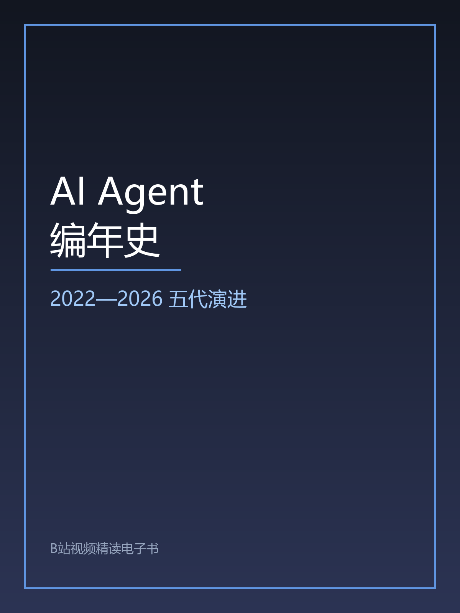

<div align="center">

# bbook

**把视频变成能读的书。**

B站 / YouTube 长视频 → 带封面、目录、章节、配图、术语表的 **EPUB**

本地转写 · 自动切章 · 不依赖任何付费 API · **一本约 ¥0.2**


[快速开始](#快速开始) · [看成品](#成品示例) · [为什么不是又一个总结工具](#为什么不是又一个总结工具) · [English](#english)

</div>


---

## 它解决什么问题

一门 46 分钟的 B 站技术长视频，你想复习其中"第三代 Agent 的 MCP 协议"那一段。

- 拖进度条？前前后后找五分钟，还容易漏。
- 用 AI 总结工具？它给你 500 字摘要，**而你想要的是那 8 分钟里的全部细节**。
- 自己整理？转录 + 分段 + 切章 + 配图，一个下午就没了。

**bbook 把这一下午变成一条命令：**

```bash
bbook run "https://www.bilibili.com/video/BVxxxxxxxxxx/"
```

跑完你会拿到 `work/<视频ID>/book.epub`——**全文一字不少**，但被整理成了能读的形态：
分好段落、切好章节、配好幻灯片截图、带上术语表和目录。

## 成品示例

<div align="center">

</div>

`examples/` 里有一本**真实产出**的电子书，可以直接下载来看：
**[AI Agent 编年史（2022—2026 五代演进）· 配图版](examples/AI-Agent编年史-配图版.epub)**（1.7 MB）

| 输入 | 输出 |
|---|---|
| 46 分钟 B 站技术视频（纯 PPT 口播） | **11 章** EPUB，1.78 MB |
| 2750 秒音频 | 878 段转写 → 100 个自然段 / 16,715 字 |
| | **33 张自动挑选的幻灯片配图**（每章 3 张，图注带真实时间点） |
| | 19 条术语表 · 10 条金句 · 11 章时间轴索引 |
| | **正文覆盖 100%**，一字未丢 |

> 该示例视频原片声明 CC BY-SA 4.0，故示例文件同样以 CC BY-SA 4.0 提供（见 `examples/README.md`）。
> **代码**是 MIT，**示例内容**是 CC BY-SA 4.0，两者分开。

## 为什么不是"又一个总结工具"

这是本项目**唯一重要**的设计立场：

> **市面上绝大多数视频工具产出的是"摘要"——信息被压缩掉了。bbook 产出的是"整理"——信息一条不丢，但变得可读。**

摘要给你结论，整理给你**能自己下结论的材料**。学习、查证、做研究，要的通常是后者。

| | AI 总结工具 | B站官方 AI 字幕 | 人工整理 | **bbook** |
|---|---|---|---|---|
| 信息完整度 | 压缩成摘要 | 全文 | 全文 | **全文** |
| 需要登录 | 否 | **是** | – | **否** |
| 段落 / 章节 | 无 | 无 | 有 | **自动生成** |
| 幻灯片配图 | 无 | 无 | 手工截图 | **自动抽帧对齐** |
| 单本耗时 | 几分钟 | 秒级 | 数小时 | **约 15 分钟（可无人值守）** |
| 单本成本 | 订阅制 | 免费 | 你的下午 | **约 ¥0.2** |

## 快速开始

```bash
# 1. 安装（[all] = 本地转写 + 抽帧配图）
pip install -e ".[all]"

# 2. 出书。对，就这一条。
bbook run "https://www.bilibili.com/video/BVxxxxxxxxxx/"

# 合集（多 P）也支持：一个分 P 自动成为一章
bbook series "https://www.bilibili.com/video/BVxxxxxxxxxx/" --limit 3
```

**它自己会做的事**：取元数据 → 下音频 → 本地转写 → 清洗归正 → 抽帧配图 → **自动切章** →
生成 EPUB → 结构审计。**全程不需要你回答任何问题。**

**缺东西会降级，不会中途崩**：

| 缺什么 | 后果 |
|---|---|
| `pandoc` | 自动用内置的零依赖 EPUB 构建器（已通过 EPUB3 合规检查） |
| `ffmpeg` | 跳过配图，其余照常 |
| `faster-whisper` | 给出安装命令 |
| `登录 cookie` | 跳过官方字幕，改用本地转写（默认路径就是这样） |

先跑一条 `bbook doctor` 就能看到本机缺什么。

### 章节标题不满意？

自动切章三级降级，**不需要你手动切**：

1. **简介时间点**——UP 主写了 `00:00 章节名` 时最准；
2. **幻灯片标题卡**——从 OCR 数据里找"短文本页"（内容页 80+ 字，标题卡二三十字）。
   实测：46 分钟视频自动切出的章节边界，**与人工切分误差在 30 秒以内**；
3. **时长兜底**。

改 `work/<id>/chapters.json` 后重跑 `bbook build` 即可——
**配图按段落索引定位，重新切章不会错位**。

## 工作原理

| Phase | 做什么 | 关键点 |
|---|---|---|
| 1 | 元数据 / 分 P 清单 | 无需登录；**分 P 标题必须走 B站 view 接口**（yt-dlp 对合集里每个 P 返回同一个标题） |
| 2 | 字幕（需登录）或音频 | 拿不到官方字幕就本地 ASR，**不阻塞** |
| 3 | 清洗 + 术语归正 | 合并短句、去语气词、**68 条术语表**修正同音错字 |
| 4 | 自动切章 | 见上 |
| 6 | 抽帧 + OCR 配图 | **丢弃画面底部字幕带**（不丢的话每帧都有字，人脸与幻灯片无法区分） |
| 7 | EPUB / DOCX 构建 | pandoc 优先，内置纯 Python 构建器兜底 |
| 8 | 审计 | 覆盖对账 + EPUB 结构校验 |

> Phase 6 要跑在 Phase 4 **之前**：幻灯片的 OCR 结果是自动切章的输入。`bbook run` 已按此编排。

**保真红线**：改写只允许补标点、删口头禅、合并重复、顺语序。
**不得添加视频里没说过的事实、数据、结论**。拿不到画面就如实标注，绝不生成假图。

## 成本

| 环节 | 成本 |
|---|---|
| 下载 / 抽帧 / OCR / 构建 / 校验 | **¥0**（全脚本化，不花 token） |
| 语音转写 | **¥0**（faster-whisper 本地 CPU，46 分钟音频约 13 分钟跑完） |
| 切章 / 起标题 / 整理 | **约 ¥0.2**（唯一花钱的地方） |

对比：把 16k 字原文整段塞进上下文反复对话，成本会从 ¥0.2 涨到 ¥20。
**所以本项目最贵的一课是上下文纪律**——字幕正文一律落盘、按需分段读。

## 已知限制（不粉饰）

- **自动切章切不出"子章节"**：它复原的是作者自己的分段（如 PPT 上的 GEN0–GEN4），做不出比作者更细的切分。要更细仍需人工过一遍。
- **ASR 会错专有名词**：本地转写把 "DeepSeek Harness" 听成过 "deep sink honeys"。术语表能修已知的，修不了没见过的。
- **没有官方字幕准**：B站 AI 字幕需登录。我们用本地 ASR 换来的是"零登录、零依赖、可离线"。
- **EPUB 合规检查是自研的**：W3C EPUBCheck 需要 Java，尚未接入 CI。
- **未验证平台**：除 B站 / YouTube 外未实测；理论上 yt-dlp 支持的站点都可用。

## 常见坑（我们替你踩过了）

| 坑 | 后果 | 我们的处理 |
|---|---|---|
| 中英之间没有词边界 | `\bjason\b` 在"的 Jason"里永远匹配不到 | 术语替换一律用 lookaround |
| 幻灯片每帧都有导航条/页码 | 分不清封面与内容页 | 自动识别高频装饰 token，**只过滤拉丁词与装饰词，绝不删单个汉字** |
| 标题卡阈值"自适应" | 幻灯片长度均匀时阈值被压到 20 出头，一张卡都认不出 | 回退为固定值，实测验证 |
| pandoc 按 cwd 解析图片路径 | 插图变成指向 EPUB 外部的死链，**且不报错** | 统一在工作目录内执行 |
| Windows 控制台是 GBK | 打印 emoji 直接 UnicodeEncodeError | 非 tty 强制 UTF-8，交互式降级为 `?` |
| huggingface_hub 下载模型失败 | 卡在第一步 | 改用 requests 直拉，带回镜像回退 |

## 开发

```bash
pip install -e ".[dev]"
python -m pytest tests -q          # 20 个用例，0.5 秒跑完，不需要模型
python tools/preflight_scan.py .   # 发布前扫描：凭据 / 大文件 / 版权风险
```

测试全部使用合成夹具，**不需要下载模型、不需要 ffmpeg/pandoc**，因此 CI 上几秒就能跑完。

## 目录结构

```
src/bbook/         实现（11 个模块）
  paths.py         工作目录契约 · 断点续跑 · 跨平台字体/工具探测
  fetch.py         Phase 1-2：元数据 / 字幕 / 音频 / 弹幕 / cookie 校验
  asr.py           Phase 2：本地转写（模型自动下载 + 镜像回退）
  text.py          Phase 3：段落化 + 术语归正
  chapters.py      Phase 4：自动切章（三级降级）
  frames.py        Phase 6：抽帧 + OCR + 幻灯片聚类
  book.py          Phase 7-8：构建 + 审计
  series.py        多 P / 合集 → 一本书
  cli.py           CLI（12 个子命令）
terms/             可插拔术语表
skills/            流水线规范（给 LLM / 人读的权威指令）
tests/             pytest 用例 + 合成夹具
tools/             发布前安全检查
```

## 路线图

- [x] 单视频一条命令出书（自动切章）
- [x] 多 P / 合集 → 一整本书
- [x] 抽帧配图 · 术语归正 · 断点续跑 · 零依赖兜底构建器
- [x] 测试 + CI（Linux / Windows × py3.9 / 3.12）
- [ ] 接入 W3C EPUBCheck（需 Java）
- [ ] 官方字幕 vs 本地 ASR 的质量 A/B
- [ ] 精编版：口语 → 书面改写（**默认关闭，保真优先**）
- [ ] 多语言输出

## 许可与免责

- **代码**：MIT（见 `LICENSE`）
- **`examples/` 中的示例电子书**：CC BY-SA 4.0（跟随原视频授权）
- 本项目**只做格式转换，不产生内容**。生成物版权归原视频作者所有。
- 请遵守目标平台的服务条款；**请勿将生成物用于商业分发**。

---

<a id="english"></a>

## English

**bbook turns long videos into readable E-books.**

Bilibili / YouTube → EPUB3 with cover, TOC, chapters, slide figures and a glossary.
Local ASR (free, offline), automatic chaptering, no paid API required. **~$0.03 worth of LLM tokens per book.**

```bash
pip install -e ".[all]"
bbook run "https://www.bilibili.com/video/BVxxxxxxxxxx/"
```

**Why not another summarizer?** Summarizers compress the information away. bbook keeps
every word and makes it *readable*: real paragraphs, real chapters, real figures pulled
from the video's own slides.

**Measured on a 46-minute technical talk:** 11 chapters, 33 auto-selected slide figures,
100% transcript coverage, 1.78 MB EPUB, ~13 min of CPU transcription, ~$0.03 of LLM cost.

See `examples/` for a real output you can download and read.
